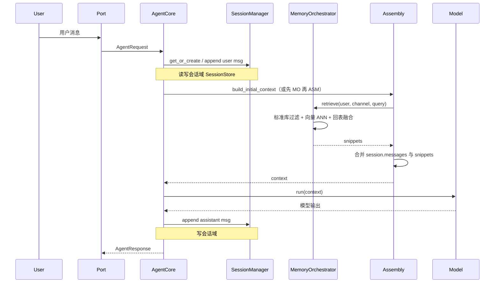

# 会话与双库长期记忆架构设计

**版本**：草案 v0.1（细化粒度：双库位置、会话内调用逻辑）  
**关联文档**：[`长期记忆定义.md`](./长期记忆定义.md)（记录类型；旧线 `LongTermMemoryStore` 已冻结，主线为 Orchestrator + 双库）  
**状态**：**已按默认组装路径部分落地**（Orchestrator + SQLite 双库 + 组装注入 + `/remember`/`/forget`/归档晋升 + `search_memory`）；细节以代码与 `memory_policy.yaml` 为准，独立向量引擎（如远程 HNSW）仍为可插拔演进项。

---

## 1. 文档目的

1. **明确双库位置**：标准数据库（关系/文档型，下称 **标准库**）与向量数据库（下称 **向量库**）在整体分层中的挂载点。  
2. **明确会话内调用逻辑**：从用户发起到模型回复的一条请求链路中，**何时读会话**、**何时读长期**、**谁调用谁**、**双库如何配合**。  
3. **明确统一管理**：双库写入顺序、主从关系、删除与质量反馈闭环，避免「两库各写各的」导致不可追溯。

---

## 2. 术语

| 术语 | 含义 |
|------|------|
| **会话域** | 当前对话状态：`Session` + `SessionStore`（含 `sessions`、归档摘要表等） |
| **长期域** | 跨会话可延续的记忆与知识，由 **标准库** + **向量库** 共同承载 |
| **记忆项（Logical Memory Item）** | 对外统一的逻辑实体，具有稳定 `memory_id`；物理上可映射标准库一行 + 向量库零条或多条向量 |
| **Memory Orchestrator** | 长期域编排组件（名称可替换）：唯一对外的「写长期 / 删长期 / 触发重索引」协调者；**不替代** `SessionManager` |

---

## 3. 双库在架构中的位置

### 3.1 分层全景

```
┌─────────────────────────────────────────────────────────────────┐
│  Port 层（HTTP/CLI 等）：请求规范化、意图解析、鉴权                │
└───────────────────────────────┬─────────────────────────────────┘
                                │
┌───────────────────────────────▼─────────────────────────────────┐
│  Agent Core（编排）：会话生命周期、Loop、安全策略、工具路由       │
│  - 依赖：SessionManager（只会话域）                              │
│  - 可选依赖：MemoryRetrievePort（读长期）、MemoryWritePort（写长期）│
└───────────────────────────────┬─────────────────────────────────┘
                                │
        ┌───────────────────────┼───────────────────────┐
        │                       │                       │
        ▼                       ▼                       ▼
┌───────────────┐     ┌─────────────────┐     ┌─────────────────┐
│ Assembly      │     │ Model           │     │ Tools           │
│ 组装上下文     │     │ 推理             │     │ 含可选 memory   │
│ **可注入**     │     │                 │     │ **检索工具**     │
│ 长期检索结果   │     │                 │     │                 │
└───────┬───────┘     └─────────────────┘     └─────────────────┘
        │
        │ 读会话：经 SessionManager / Session 快照
        │ 读长期：经 Memory Orchestrator 的只读门面（见 §6）
        ▼
┌─────────────────────────────────────────────────────────────────┐
│  数据面（持久化）                                                 │
│  ┌──────────────────────┐      ┌────────────────────────────┐  │
│  │ 会话域                │      │ 长期域                      │  │
│  │ SessionStore         │      │ ┌──────────┐  ┌───────────┐ │  │
│  │ (e.g. SQLite 会话库)  │      │ │ 标准库    │  │ 向量库     │ │  │
│  │ sessions / archives  │      │ │ 主数据    │  │ 语义索引   │ │  │
│  └──────────────────────┘      │ └──────────┘  └───────────┘ │  │
│                                  └──────────┬─────────────────┘  │
│                                             │                     │
│                                  Memory Orchestrator（写协调）     │
└─────────────────────────────────────────────────────────────────┘
```

**要点**：

- **双库只属于长期域**；**会话域单独一套存储**（与《长期记忆定义》一致）。  
- **Core 不直接连向量库**；通过**窄接口**（只读检索、异步/同步写）连接 **Memory Orchestrator** 或其只读投影。  
- **Assembly** 是「把长期检索结果写进上下文」的**首选挂载点**；**Tools** 是「模型主动要查再查」的**可选挂载点**。

### 3.2 标准库 vs 向量库：职责对照（细粒度）

| 维度 | 标准库 | 向量库 |
|------|--------|--------|
| **角色** | 长期域 **权威（source of truth）** | 长期域 **派生索引（derivative）** |
| **存什么** | `memory_id`、类型、用户/租户、`user_id`、`channel` 策略字段、**完整正文或结构化字段**、信任度、合规标记、`source_session_id`、版本、创建/更新时间、**embedding 状态**（如 `pending` / `ready` / `stale`） | **切片文本**（或与标准库一致的片段 ID）、**向量**、**最小元数据**（`memory_id`、`chunk_id`、`user_id`、可选 channel） |
| **擅长查询** | 主键、用户维度列表、时间范围、类型过滤、偏好键精确读 | 语义近邻（ANN）、部分产品的元数据过滤 |
| **写入触发** | 仅由 Orchestrator 在策略通过后写入/更新 | Orchestrator 在标准库落库成功后 **投影**；可 **异步** |
| **删除** | 逻辑删除/硬删除 + 审计 | 按 `memory_id` / `chunk_id` **级联删或过滤失效** |

**原则**：任何「业务上唯一真相」以标准库为准；向量库丢数据或重建索引时，应能根据标准库 + 切块策略 **重放**。

---

## 4. 逻辑记忆项与双库映射

### 4.1 一对多关系

- 一条 **逻辑记忆项**（如一条 `MemoryChunk` 业务语义）→ 标准库 **1 行主记录**。  
- 同一正文经 **切块** → 向量库 **N 条** 向量（N≥0；极短文本可为 1）。  
- **偏好 / 事实** 等结构化记录：标准库为主；**仅当需要语义检索**时才向量化（N≥0）。

### 4.2 建议的稳定标识

| ID | 用途 |
|----|------|
| `memory_id` | 全局唯一，标准库主键；向量元数据必带，用于回表 |
| `chunk_id` | 可选；同一 `memory_id` 下多切片时唯一 |
| `source_session_id` / `source_message_id` | 溯源至会话域（仅存标准库或双库元数据，按隐私策略裁剪） |

---

## 5. Memory Orchestrator（统一管理）边界

### 5.1 职责（必须）

1. **写入编排**：校验策略 → 写标准库 → 再触发切块与向量索引（同步或入队）。  
2. **删除/撤回**：更新标准库状态 → 通知向量侧删除或标记不可检索。  
3. **重索引**：嵌入模型或切块策略变更时，按 `memory_id` 重算向量。  
4. **只读门面（给 Assembly / Tools）**：`retrieve_for_context(query_context) -> ranked_snippets`，内部可 **并行查标准库（关键词/过滤）与向量库（ANN）**，再 **融合排序**（如 RRF）。

### 5.2 非职责（避免膨胀）

- 不管理 **当前 Session 内消息顺序**（属于 `SessionManager`）。  
- 不替代 **模型选工具** 的业务逻辑（仅提供工具实现背后的数据访问）。  
- 不在此层做 **最终安全裁决**（输入/输出护栏仍在 Core / Guard 策略）。

### 5.3 与配置的关系（「配置端」落点）

| 配置项 | 建议归属 |
|--------|----------|
| 双库后端 ref、嵌入 ref | `memory_policy.yaml` 的 `dual_store_ref` / `embedding_ref`（`app/memory_orchestrator_registry.py`） |
| 嵌入模型、向量维度 | `embedding_dim` 与 `embedding_ref` 约定；`builtin:openai_compatible` 时可选 **`embedding_openai`**（`api_key_env` / `base_url` / `model` / `timeout_seconds`）；密钥仅环境变量 |
| 切块大小、重叠、边界规则 | Orchestrator 或独立 Ingestion 子模块配置 |
| 每用户召回条数、score 阈值 | 检索策略配置（可挂在 Assembly 或 Orchestrator） |
| `storage_profiles` 中 memory 路径、向量服务地址 | 资源索引 / 环境配置 |

---

## 6. 会话中的调用逻辑（单次请求）

以下描述 **一条用户消息** 从进入到模型开始推理的 **推荐主路径**；实现时可把部分步骤合并为一次服务调用。

### 6.1 阶段划分

| 阶段 | 名称 | 与会话 / 双库关系 |
|------|------|-------------------|
| S0 | 请求进入 | Port 构造 `AgentRequest`（含 `user_id`、`channel`、payload、intent） |
| S1 | 会话解析 | Core：`SessionManager.get_or_create_session` / `get_session` → **只读会话域** |
| S2 | 安全与策略 | Core：会话配置上的护栏（与会话域相关） |
| S3 | 用户消息落会话 | `append_message` → **写会话域** |
| S4 | **长期检索（读）** | Assembly **之前或内部**：调用 Orchestrator **只读门面** → **读标准库 + 向量库**（见 §6.2） |
| S5 | 组装上下文 | Assembly：`build_initial_context(session, request, memory_hits?)` → 合并 **会话消息窗口** + **长期片段** |
| S6 | Loop | Model / Tools；可选 **Tools 再次检索**（§6.3） |
| S7 | 回复落会话 | 助手消息 `append_message` → **写会话域** |

**写长期域**不在上述每轮必经路径中；由 **显式意图 / 归档流水线 / 异步任务** 触发（§7）。

### 6.2 S4 细部：检索如何同时用双库

**输入**（概念）：`user_id`、当前 `channel`、本轮用户文本（或改写 query）、会话内可选摘要（避免重复检索）。

**Orchestrator 内部推荐步骤**：

1. **标准库路径**（可选，低成本）：按用户拉取「必注入」类数据（如 `UserPreference` 精确键）、或 FTS/BM25 若已建在标准库侧。  
2. **向量路径**：对 query 编码 → ANN → 得到候选 `chunk_id` / `memory_id` + score。  
3. **回表**：用 `memory_id` 从标准库取 **权威正文** 与 **信任度、过期、禁用标记**；丢弃已 tombstone 的项。  
4. **融合**：RRF 或加权合并标准库与向量候选 → **截断 Top-K** → 输出给 Assembly。  

**输出**（概念）：`List[MemorySnippet]`，每项含 `text`、`memory_id`、`score`、`provenance`（供组装层写进 system 或独立「记忆」块）。

### 6.3 Loop 内：何时再走向量检索

| 方式 | 触发 | 调用逻辑 |
|------|------|----------|
| **仅组装前检索** | 默认 | S4 一次；Tools 不暴露 memory |
| **组装前 + 工具** | 需要「按需深挖」 | 模型发出 `search_memory` → Tool 调 Orchestrator 同一只读门面 → `apply_tool_result` 再进上下文 |
| **仅工具** | 极省 token | 不在 S4 检索；仅工具调用时检索（延迟高、易漏首轮上下文） |

推荐默认 **S4 轻量检索 + 工具可选加深**。

### 6.4 时序图（主路径）



---

## 7. 写长期域：双库顺序与调用逻辑

### 7.1 触发源（与单轮对话解耦）

| 触发 | 说明 |
|------|------|
| 用户显式意图 | 如「请记住 …」解析后调用 Orchestrator `ingest` |
| 归档/会话结束策略 | 流水线异步：从 `Session` / `session_archives` 生成候选 → 策略审核 → 写入 |
| 运营/批任务 | 重索引、全量重建向量 |

### 7.2 写入顺序（强制）

```
1. 策略与去重（Orchestrator）
2. INSERT/UPDATE 标准库主记录 → 得到 memory_id
3. 切块 → 生成 chunk 列表
4. 嵌入 → 写向量库（附 memory_id, chunk_id）
5. 更新标准库 embedding_status = ready（或失败则 failed / 重试队列）
```

**禁止**：先写向量库后写标准库（会导致孤儿向量、无法回表）。

### 7.3 异步与一致

- 允许 **4–5 异步**；标准库可先标 `embedding_pending`，检索时 **过滤未就绪** 或 **仅关键词路径可见**。  
- 失败重试队列应带 `memory_id`，避免重复业务行。

---

## 8. 质量与对话效果闭环

| 环节 | 做法 |
|------|------|
| 注入可控 | Top-K、score 阈值、按 `trust` 过滤低可信片段 |
| 可解释 | 组装层附带「来源 memory_id」供日志或 UI（不必然展示给用户） |
| 用户纠正 | 「忘掉 X」→ Orchestrator 更新标准库 + 删向量 |
| 评测 | 离线：召回率；在线：点踩关联 `memory_id` 降权或删除 |

---

## 9. 与当前代码库的映射（实现落点时）

| 设计概念 | 当前或拟议代码位置 |
|----------|-------------------|
| 会话域 | `SessionStore` / `SqliteSessionStore`、`SessionManagerImpl` |
| 长期协议（待扩展） | `LongTermMemoryStore` 可拆为 **标准库 DAO** + **向量索引客户端** 两个实现，由 Orchestrator 组合；或 Orchestrator 单类内聚两适配器 |
| 组装注入点 | `AssemblyModule.build_initial_context` 签名扩展或旁路注入 `memory_hits` |
| 配置 | `storage_profiles.yaml`：可拆 `memory.standard` / `memory.vector` 两段（评审后改 schema） |
| Core | **不**在 Loop 内硬编码写长期；仅注入 `MemoryRetrievePort` / 工具依赖 |

---

## 10. 分阶段落地建议

1. **P0**：标准库 schema + Orchestrator 写路径（无向量，`embedding_status` 预留）。  
2. **P1**：向量库接入 + 异步嵌入 + S4 只读检索接入 Assembly。  
3. **P2**：混合检索（标准库 FTS/BM25 + 向量）+ 可选 rerank。  
4. **P3**：归档/显式记忆触发与策略引擎（与产品规则绑定）。

---

## 11. 修订记录

| 日期 | 说明 |
|------|------|
| 2026-03-23 | 初稿：双库位置、会话内调用时序、Orchestrator 写入顺序与检索融合 |
